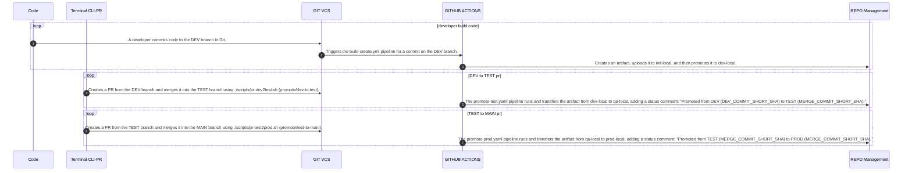
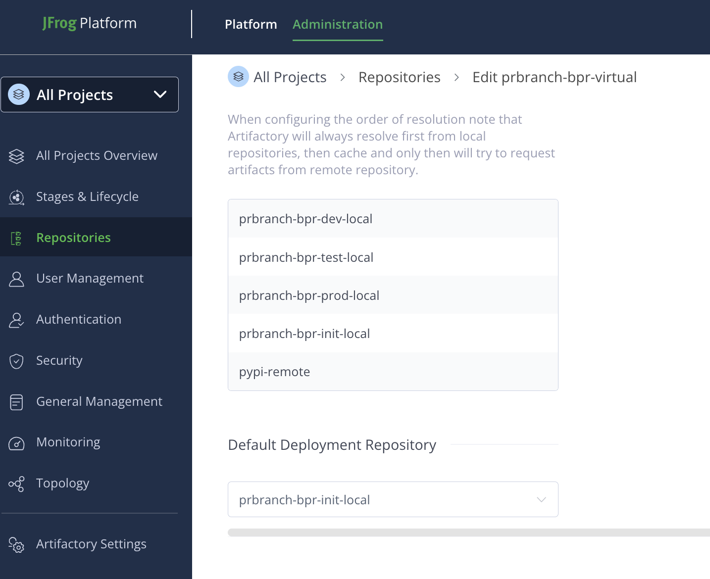
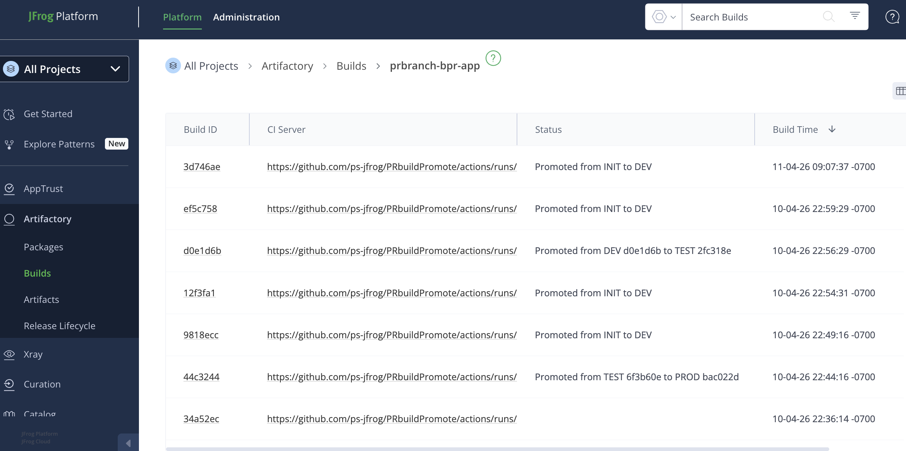
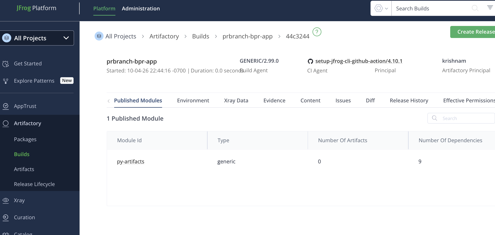
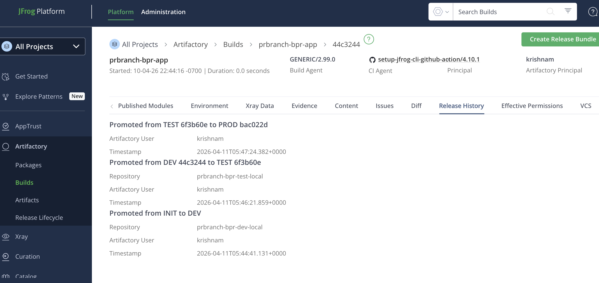
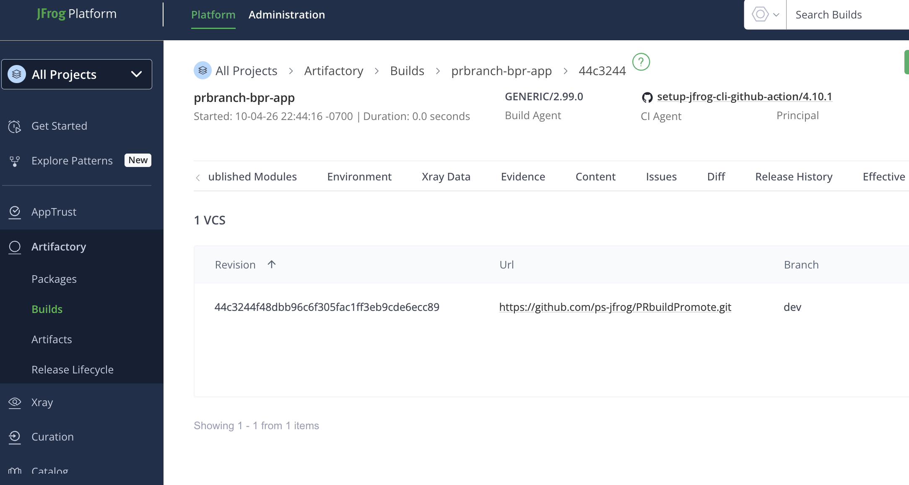
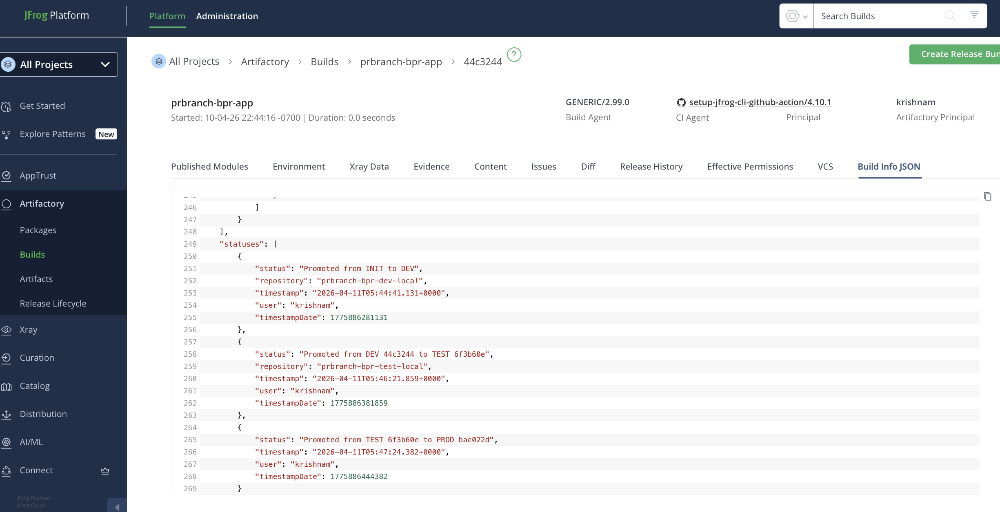

# GIT branching strategy to Build Promote
This project captures a structured promotion flow with MAIN governing three controlled branches (DEV, TEST, Main/PROD) and enforcing build immutability and promotion-based lifecycle:

This representation enforces promotion over rebuild, ensures traceability across environments, and embeds governance gates before production release-driving consistency, reliability, and auditability across the delivery pipeline.

**NOTE:** Lengend
 - **CC**: A developer code commit to the DEV branch automatically triggers a new build and publishes the artifacts to the JFrog platform.
 - **PR**: Every pull request from DEV → TEST or TEST → MAIN promotes the corresponding DEV branch build to the next local repository.
     - **DEV → TEST**: promote from _prbranch-bpr-dev-local_ to **prbranch-bpr-test-local**
     - **TEST → MAIN**: promote from _prbranch-bpr-test-local_ to **prbranch-bpr-prod-local** 
 

### Actions status:
 - **branch DEV**: Artifactory create and build published to _prbranch-bpr-dev-local_ 
 - **branch TEST**: git merged from DEV, Artifactory build promoted to _prbranch-bpr-test-local_ 
 - **branch MAIN**: git merged from TEST, Artifactory build promoted to _prbranch-bpr-prod-local_ 

### Sequence Flow

## Screenshots

### Repo structure

### Builds

