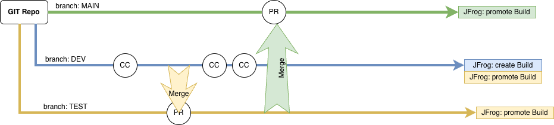

# 
This project captures a structured promotion flow with MAIN governing three controlled branches (DEV, TEST, Main/PROD) and enforcing build immutability and promotion-based lifecycle:

This representation enforces promotion over rebuild, ensures traceability across environments, and embeds governance gates before production release—driving consistency, reliability, and auditability across the delivery pipeline.